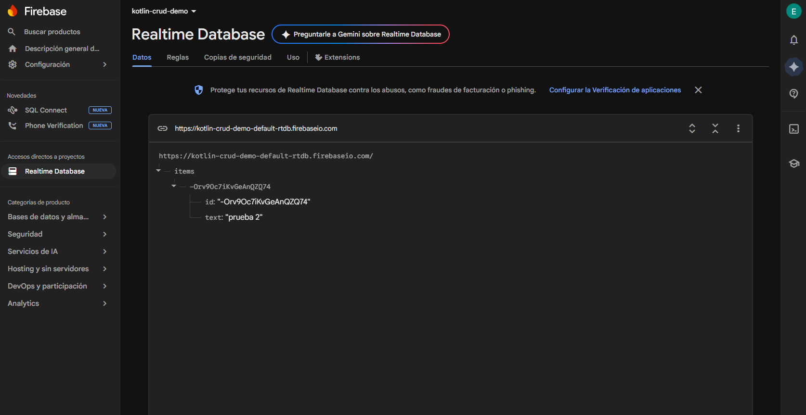
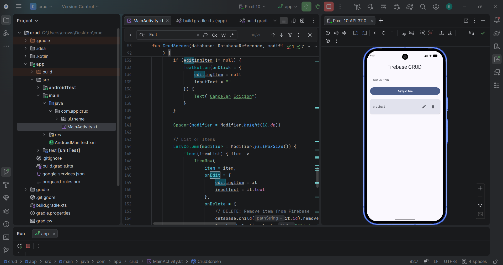

# Firebase CRUD Application

Esta aplicación Android demuestra la implementación de un sistema de gestión de datos persistente utilizando **Firebase Realtime Database**. El proyecto está estructurado para manejar el ciclo de vida completo de la información a través de operaciones de creación, lectura, actualización y eliminación de registros de manera eficiente.

### Tecnologías Utilizadas
- **Kotlin**: Lenguaje de programación principal.
- **Jetpack Compose**: Kit de herramientas moderno para la construcción de interfaces nativas.
- **Firebase Realtime Database**: Base de datos NoSQL alojada en la nube para el almacenamiento y sincronización de datos en tiempo real.
- **Material Design 3**: Implementación de estándares de diseño modernos para una experiencia de usuario fluida.

### Funcionalidades Clave
- **Persistencia en la Nube**: Los datos se almacenan de forma segura en Firebase, garantizando la disponibilidad de la información.
- **Sincronización en Tiempo Real**: La interfaz de usuario utiliza observadores reactivos que se actualizan automáticamente ante cualquier cambio en la base de datos.
- **Interfaz Intuitiva**: Implementación de una lista dinámica (LazyColumn) con acciones rápidas para edición y borrado de elementos.

### Previsualización

